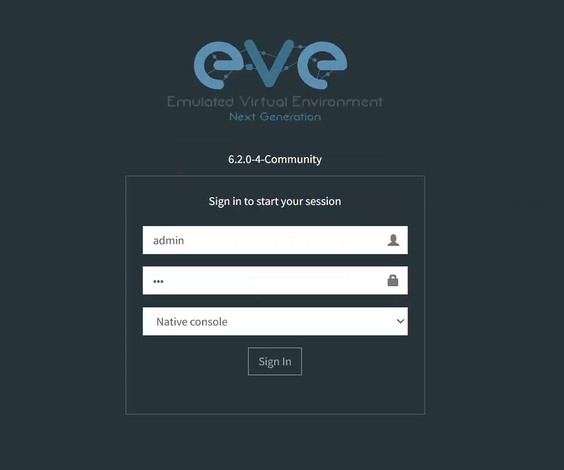
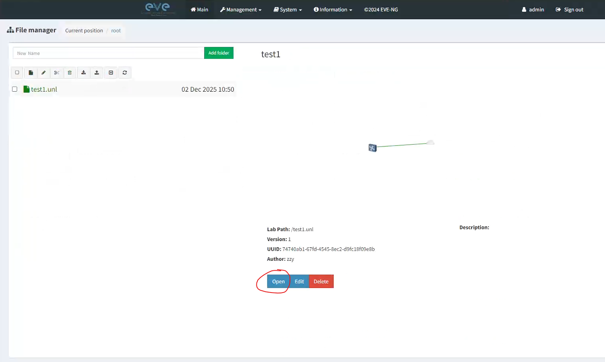
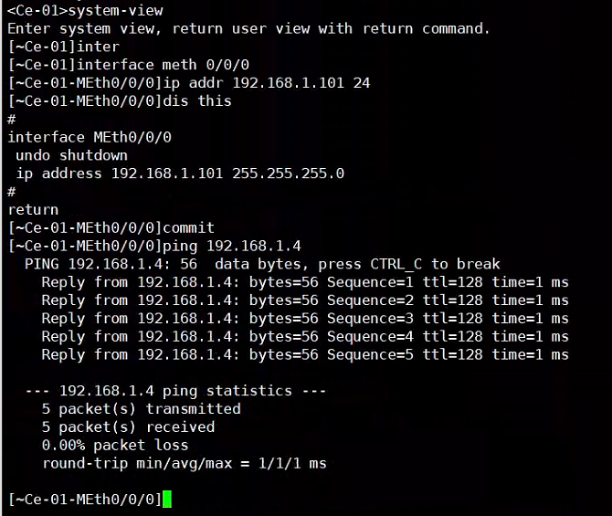

#### 下载EVE-NG镜像

**官方网站**：[https://www.eve-ng.net/index.php/download/](https://www.eve-ng.net/index.php/download/)

**1. EVE-NG 系统镜像**：找到`Free EVE Community Edition Version`选择下载，这里下载的是**ISO安装镜像**，需要在VMware中新建虚拟机安装

**2. Windows 工具包（可选但建议）**：页面下方的`Windows Client Side`是一个集成了一些必要客户端工具（如 PuTTY、Wireshark 等）的包，建议下载以方便后续操作

#### 安装并运行EVE-NG

**1. 创建虚拟机**
在 VMware 中新建虚拟机，关键配置如下：

| 组件 | 推荐配置 | 说明 |
| :--- | :--- | :--- |
| **内存** | 4 GB | |
| **处理器** | 2 个处理器，每个 2 个内核 | *注：这是**最小需求**。可根据硬件情况和需求适当增加 CPU 核心和内存* |
| **硬盘** | 50 GB | |
| **CD/DVD** | 使用 ISO 映像文件 | 选择刚才下载的 EVE-NG ISO 镜像 |

**2. 配置网络适配器**
- **适配器 1 (网络连接1)**：设置为 `桥接模式`，并勾选 `复制物理网络连接状态`
- **适配器 2**：点击`添加`新的网络适配器，设置为`仅主机模式`

**3. 安装与启动**
运行虚拟机，按照屏幕提示（基本上一路回车）完成安装。出现以下界面即表示启动成功：

- 首行会提示你默认的`root`密码为`eve`
- 第二行是EVE的Web管理页面地址，按前面配置的桥接模式，这里应该是一个与真机网卡同网段的ip地址。**如果不是**，可以进入 VMware `编辑` -> `虚拟网络编辑器`，点击`VMnet0`，将 `已桥接至` 的下拉菜单从`自动`改为你**真机正在使用的物理网卡**
#### 导入设备镜像

这里以 QEMU 镜像为例（通常包含 `.png` 图标、`.yml` 配置、`.tgz` 镜像包）

1. 将yml上传至`/opt/unetlab/html/templates/intel/`，如果是AMD的CPU上传至`/opt/unetlab/html/templates/amd/`

2. 将图标文件上传到`/opt/unetlab/html/images/icons/`

3. 将tgz压缩包上传至`/opt/unetlab/addons/qemu/`，然后用tar -xzf解压缩

4. 使用`/opt/unetlab/wrappers/unl_wrapper -a fixpermissions`命令修复权限

#### 在Web界面上添加设备并运行

**1. 登录**：浏览器访问之前获取的 Web 管理地址，默认的登录名和密码是admin和eve

**2. 创建实验(Lab)**：点击`Add New Lab`创建一个测试Lab，选中Lab后点击`Open`进入Lab

**3. 添加并启动设备**：
点击左上角`Add an object`，选择`Node`，然后在`Template`中选择刚刚导入的设备模板，然后下面的设备参数可以先不调整，点击`Save`保存

然后在设备图标**右键**-`Start`即可令设备开机

**4. 连接设备控制台**：如果前面下载安装了`Windows Client Side`，在运行的设备上双击**左键**即可自动调用工具包中的 **PuTTY** 通过 **Telnet** 连接到EVE上运行的设备

在*PuTTY 标题行处右键-Event Log*，可查看连接使用的 **IP 和端口**，便于使用其他客户端手动连接

#### 如何令内部运行的设备与真机互连

**原理**：将 EVE 内部虚拟设备的接口，连接到代表物理网卡的 **Cloud** 网络对象上

| Cloud 类型 | 对应的 VMware 适配器模式 | 用途 |
| :--- | :--- | :--- |
| **Cloud0** | 桥接模式 | **连接外部物理网络**，实现与真机、互联网或其他物理设备互通。 |
| **Cloud1** | 仅主机模式 | **创建隔离的内部网络**，便于构建不与外界直接通信的封闭拓扑。 |

**操作步骤**

**1. 添加网络**：在Lab内点击左上角`Add an object`，选择`Network`。在 `Type` 中选择 **Cloud0**

**2. 连接设备**：接下来在设备关机的情况下，拖动设备图标右侧的`connect to another node`图标，连接到我们添加的**Cloud0**网络上，并在弹出窗口中选择要互联的物理接口

**3. 配置与测试**：
通过Telnet连接到设备的控制台，为互联端口配置一个与**真机同网段**的IP地址和掩码，然后Ping真机IP地址查看连通性

然后用真机Ping设备的IP地址查看连通性

*注：如果Ping不通，则有可能是防火墙策略问题，可以临时关闭防火墙（非生产环境），或临时放通ICMP协议进行测试*