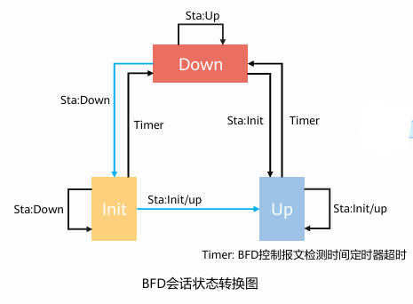

## BFD

BFD(Bidirectional Forwarding Detection，双向转发检测)提供了一个通用的、标准化的、介质无关和协议无关的快速故障检测机制，用于快速检测、监控网络中链路或者IP路由的转发连通状态

在无法通过硬件信号检测故障的系统中，应用通常采用上层协议（例如OSPF）本身的Hello报文机制检测网络故障

BFD本质上是一个简单的Hello协议，即超时不应答就可认为连接不通

### BFD会话状态

每个BFD系统根据自身的状态和收到的对端BFD报文中的State字段来进行转换

Init：表示本端期望进入Up状态，但远端暂时没回应
Up：表示BFD会话成功建立，并正在确认链路连通性
Down：表示链路不通
管理Down：是被管理员手工Down的状态，不会自动转换为其他状态，除非手动解除Down

### 检测模式

**异步模式**

异步模式下本端按一定的发送周期发送BFD控制报文，检测位置为**远端**，远端检测本端是否周期性发送BFD控制报文

**查询模式**

查询模式下本端连续发送对各BFD控制报文，**本端**检测自身发送的BFD控制报文是否得到了回应

**回声模式**

BFD Echo功能也称为BFD回声功能，是由本地发送BFD Echo报文，远端系统将报文环回的一种检测机制

在两台直接相连的设备中，其中一台设备支持BFD功能;另一台设备不支持BFD功能，只支持基本的网络层转发。

为了能够快速的检测这两台设备之间的故障，可以在支持BFD功能的设备上创建单臂回声功能的BFD会话。支持BFD功能的设备主动发起回声请求功能，不支持BFD功能的设备接收到该报文后直接将其环回，从而实现转发链路的连通性检测功能

### BFD的应用

由BFD**监测模块**进行链路信息检测并反馈给**Track模块**，然后**应用模块**（例如VRRP、静态路由、OSPF、路由策略等）根据Track的状态进行相应的处理

