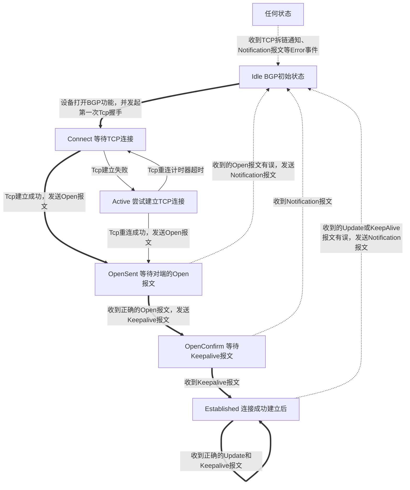

## BGP

### AS

指同一实体管辖下，选路策略相同的设备集合

AS号有16bit和32bit两种，16bit的私有号为64512-65534，32bit的私有号为4200000000-4294967294

两个AS之间需要有直连链路，或者通过VPN构造逻辑直连

AS之间可能是无法完全信任的机构或公司，使用OSPF这种IGP协议可能会暴露内网的网络结构

因此为AS之间的路由传递专门设计了BGP（边界网关协议）

### BGP概述

使用TCP作为传输层协议，端口号179

- **BGP Speaker**：运行BGP的路由器
- **对等体（Peer）**：两个建立BGP会话的路由器互为对等体
  - **EBGP**：位于两个AS的路由器之间建立的对等体
  - **IBGP**：位于相同的AS的路由器之间建立的对等体

#### 对等体关系

对等体建立之前会由先启动的设备用随机端口号向对端的179端口发起TCP握手，TCP建立成功后互相发送Open报文，之后定期发送Keepalive保持连接

*由于参与建立的路由器都会发起TCP三次握手，那么一对对等体往往会建立两个TCP连接，实际BGP会在Open报文中找到对端的Router-id，与自身比较，保留Router-id较大的一方建立的TCP连接*

在部署IBGP对等体时，建议使用LoopBack地址作为源地址，这样可以利用AS内部的网络冗余保证可靠性

在部署EBGP对等体时，建议使用直连接口的IP地址作为源地址。如果使用Loopback可能会出现多跳的问题

#### 报文类型

| 名称          | 作用                         | 发送时间                             |
| ------------- | ---------------------------- | ------------------------------------ |
| Open          | 建立对等体关系               | TCP建立成功后                        |
| Update        | 发送BGP路由更新              | 路由变化时向对等体发送               |
| Notification  | 报告错误信息，终止对等体关系 | 在运行时发现错误时                   |
| KeepAlive     | 保持对等体连接               | 初次建立连接以及后续定时发送         |
| Route-refresh | 用于改变路由策略后的路由刷新 | 在改变路由策略后向对等体重新发送路由 |

*在Open报文协商时会协商是否支持Route-refresh，如果对等体支持此能力，可以通过refresh bgp命令对BGP进行软复位，即不关闭连接即可重新刷新路由表，应用新的路由策略*

*对于不支持路由刷新的对等体，可以配置keep-all-routes命令，会保留该对等体的所有路由，不复位BGP连接即可完成路由表的刷新*

#### BGP状态机

从报文角度来看：


*注：Route-refresh报文不会改变BGP状态*

#### BGP的路由生成

BGP自身并不会发现和计算产生路由，BGP将IGP路由表注入到BGP路由表中，并通过Update传递给BGP对等体

- 通过network命令注入，可以将已经存在于IP路由表中的路由注入到BGP中
- 通过import-route命令注入，可以将 **直连路由、静态路由、OSPF、IS-IS** 等协议的路由注入到BGP中

#### BGP路由聚合
 
通过`aggregate`命令可以进行手工聚合

如果在执行命令时指定了`detail-suppressed`，那么BGP只会向对等体传递聚合后的路由，而不通告聚合前的明细路由

#### BGP的路由通告原则

1. 只发布最优且有效的路由：`display bgp routing-table`查看路由表时，路由条目最前面有`*>i`标识，`*`代表有效，`>`代表最优
2. 从EBGP获取的路由会发布给所有对等体
3. 从IBGP获取的路由不会再发布给其他IBGP，又被称为IBGP水平分割原则
4. 当一台路由器从自己的IBGP对等体学习到一条BGP路由时(这类路由被称为IBGP路由)，它将不能使用该条路由或把这条路由通告给自己的EBGP对等体，除非它又从IGP协议(例如OSPF等，此处也包含静态路由)学习到这条路由，该条规则也被称为BGP同步原则。


#### BGP与传统IGP的区别
1. BGP基于TCP，只要能建立TCP就能建立BGP，也就是说不需要物理直连
2. 只传递路由信息，不暴露拓扑
3. 不进行周期时更新，只做触发式更新
4. 每条BGP路由上都会携带多种路径属性，可以在不同场景下选用不同的路径控制

#### BGP常用命令

```
# 创建bgp进程
bgp {as-number-plain|as-number-dot}

# 指定router-id
router-id ipv4-address

# 配置对等体
peer 地址 as-number as号

# 配置建立对等体时使用的地址等信息
peer 地址 connect-interface 接口
peer 地址 ebgp-max-hop 跳数

# 华三某型号需要在地址族中使能Peer，配置如下
bgp 64512
  router-id 10.0.4.4
  peer 10.0.2.2 as-number 64512
  peer 10.0.2.2 connect-interface LoopBack0
  peer 10.0.3.3 as-number 64512
  peer 10.0.3.3 connect-interface LoopBack0
  address-family ipv4 unicast
    peer 10.0.3.3 enable
    peer 10.0.2.2 enable

# EBGP如果想使用Loopback地址往往需要配置静态路由
ip route-static Loopback地址 32 直连对端接口的地址

```

#### BGP路径属性

BGP路由会携带多种路径属性，分别为：
1. 公认必遵(Well-known Mandatory)：必须包括在每个Update消息里
2. 公认任意(Well-known Discretionary)：可能包括在某些Update消息
3. 可选过渡(OptionalTransitive)：BGP设备不识别此类属性依然会接受该类属性并通告给其他对等体
4. 可选非过渡(OptionalNon-transitive)：BGP设备不识别此类属性会忽略该属性，且不会通告给其他对等体

以下列举常见的BGP路径属性

##### 公认必遵

###### AS_PATH

指前往目标网络经过的AS号，在通告给EBGP时会加上自身AS号，通告给IBGP时不会

可以用来防止环路，当接收到的路由AS_PATH中存在自身AS号，不会接受此路由

另一个作用是路径优选，即会选择AS号个数更少的路由

*当路由聚合时，会丢失AS_PATH属性，为此可以在聚合路由时配置as-set参数，这样AS_PATH中会包含一个{}包含的AS号集合，用来防止环路*

###### Origin

标识BGP路由的起源

| 起源名称   | 标记 | 描述                                  |
| ---------- | ---- | ------------------------------------- |
| IGP        | i    | 此路由是由始发路由器通过network注入的 |
| EGP        | e    | 通过EGP学习到的                       |
| Incomplete | ?    | 通过其他方式学到的，例如import-route  |

当去往同一目的地存在多条不同Origin的路由时，选路策略为IGP>EGP>Incomplete

###### Next_Hop

指定下一跳地址，当下一跳可达时，这一条路由才是可用的

*由于有些情况下路由器传递路由时不会修改Next_Hop属性*，使用`peer next-hop-local`可以设置向IBGP通告路由时，把下一跳属性设为自身的TCP连接源地址

##### 公认任意

###### Local_Preference

本地优先级属性，告知AS中的路由器：哪条路径是离开本AS的首选路径

值越大则优先级越高，只能传递给IBGP，不能传递给EBGP

##### 可选过渡

###### Community

是一种标记，用于简化路由策略的执行。如果配置了Community，就不用根据网络前缀之类的信息匹配路由并执行相应的路由策略了

格式一般是`2Byte:2Byte`

##### 可选非过渡

###### MED

用于向外部对等体指出进入本AS的最佳路径，MED属性值越小则BGP路由越优

#### 路由反射器

IBGP水平分割规则用于防止AS内部产生环路，在很大程度上杜绝了IBGP路由产生环路的可能性，但是同时也带来了新的问题：
1. BGP路由在AS内部只能传递一跳
2. 如果建立IBGP对等体全互联模型又会加重设备的负担

为此可以采用路由反射技术

即选择路由器成为路由反射器（RR），RR会将学习的路由反射出去，从而使IBGP路由在AS内无需建立IBGP全连接

将一台BGP路由器指定为RR后还需要为其指定其对应的Client，Client本身不需要做任何配置

##### 路由反射

RR在接收BGP路由时:
1. 如果路由反射器从自己的非客户对等体学习到一条IBGP路由，则它会将该路由反射给所有客户
2. 如果路由反射器从自己的客户学习到一条IBGP路由，则它会将该路由反射给所有非客户，以及除了该客户之外的其他所有客户
3. 如果路由学习自EBGP对等体，则发送给所有客户、非客户IBGP对等体

*反射时不会修改Next_Hop、AS_PATH、Local_Preference、MED等属性，否则可能引起环路*

由于路由反射打破了水平分割原则，又可能导致环路产生，为此RR会为BGP路由添加Originator_ID、Cluster_List两个属性

**Originator_ID**

本地AS、中通告该路由的BGP路由器的Router-id

当BGP路由器收到一条带有Originator_ID的IBGP路由时，如果值和自身的Router-id相同，则它会忽略这条路由的更新

**Cluster_List**

Cluster指路由反射簇，包括RR及其Client。一个AS内允许存在多个路由反射簇

每一个簇都有唯一的簇ID(Cluster_ID，缺省时为RR的BGP Router ID)

当一条路由被反射器反射后，该RR(该簇)的Cluster_ID就会被添加至路由的Cluster_list属性中

当RR收到一条携带Cluster_list属性的BGP路由，且该属性值中包含该簇的Cluster_ID时，RR认为该条路由存在环路，因此将忽略关于该条路由的更新

**路由反射的配置命令**

```
# 配置反射器及其客户端
peer {group-name|ipv4-address} reflect-client

# 配置集群id
relector cluster-id *cluster-id* # 缺省情况下使用自身的router-id
```

#### BGP路由优选原则

丢弃下一跳不可达的路由。
1. 优选Preferred-Value属性值最大的路由。
2. 优选Local Preference属性值最大的路由。
3. 本地始发的BGP路由优于从其他对等体学习到的路由，本地始发的路由优先级:优选手动聚合>自动聚合>networkc>import>从对等体学到的。
4. 优选AS Path属性值最短的路由。
5. 优选Origin属性最优的路由。Origin属性值按优先级从高到低的排列是:IGP、EGP及Incomplete。
6. 优选MED属性值最小的路由。
7. 优选从EBGP对等体学来的路由(EBGP路由优先级高于IBGP路由)。
8. 优选到Next Hop的IGP度量值最小的路由。
9. 优选Cluster List最短的路由。
10. 优选RouterID(OrqinatorID)最小的设备通告的路由。
11. 优选具有最小IP地址的对等体通告的路由。

### BGP配置路由汇总的过程

1. 创建ip前缀列表

华为命令：`ip ip-prefix 1 permit 172.16.0.0 16 greater-equal 24 less-equal 24`
华三命令：`ip prefix-list 1 permit 172.16.0.0 16 greater-equal 24 less-equal 24`

2. 创建Route-Policy，并在其中调用ip前缀列表

华为命令：
```
route-policy hcip permit node 10
  if-match ip-prefix 1
```

华三命令：
```
route-policy hcip permit node 10
  if-match ip address prefix-list 1
```

3. 在BGP中引入路由时可指定路由策略

```
bgp 64511
  import-route direct route-policy hcip 
  summary automatic # 自动汇总只会对import-route的路由生效
```

### MP-BGP

MP-BGP(Multiprotocol Extensions for BGP-4)在RFC4760中被定义，用于实现BGP-4的扩展以允许BGP携带多种网络层协议(例如IPV6、L3VPN、EVPN等)

这种扩展有很好的后向兼容性，即一个支持MP-BGP的路由器可以和一个仅支持BGP-4的路由器交互

BGP-4规定IPV4的NEXT HOP和AGGREGATOR属于Path attributes字段，IPv4的NLRI中携带IPv4的路由条目

MP-BGP新增Path attributes的字段，将对应的网络层协议的NEXT HOP字段和NLRI归属于MP_REACH_NLRI

MP_UNREACH_NLRI用于撤销不可达路由的信息

#### MP_REACH_NLRI

MP_REACH_NLRI被携带于Update报文中，详细字段如下：

| MP_REACH_NLRI格式                                 | 字段说明                                                     |
| ------------------------------------------------- | ------------------------------------------------------------ |
| Address Family ldentifier (2 octets)              | 该字段标识了网络层协议，例如2表示IPv6                        |
| Subsequent Address Family ldentifier (1 octet)    | 该字段和AFI一起使用，例如1表示unicast，结合AF为2表示IPv6单播 |
| Length of Next Hop Network Address (1 octet)      | 该字段表示下一跳地址的长度                                   |
| Network Address of Next Hop (variable)            | 该字段为此下一跳地址，格式由AF和SAFI决定                     |
| Reserved (1 octet)                                | 保留字段、全为0                                              |
| Network Layer Reachability Information (variable) | 该字段变长可包含可达的路由                                   |

*例如EVPN的AFI为25（L2VPN）、SAFI为70（EVPN）*

### EVPN

**MPLS**

MPLS(Multiprotocol Label switching，多协议标记交换)位于TCP/IP协议栈中的数据链路层和网络层之间，在两层之间增加了额外的MPLS头部。

报文转发直接基于MPLS头部。MPLS头部又被称为MPLS标签(Label)。

在MPLS域（一系列连续的运行MPLS的网络设备），直接以标签交换替代IP转发，实现了基于标签的快速转发。

**VPLS**

Virtual Private LAN Service，是一种基于以太网的二层VPN技术，在MPLS网络中提供类似LAN的业务，允许用户从多个地址接入网络

传统的L2VPN业务例如VPLS(Virtual Private LAN Service)，提供用户远程站点之间二层连接服务。

它组建二层交换网，像二层交换机一样透传以太报文。

因此在传统L2VPN中对于远端MAC地址的学习依靠ARP广播泛洪，PE设备将需要承载广播流量。广播占用较多的接口带宽，这是传统L2VPN的一个典型问题。

**EPVN**

相较于VPLS的新的二层VPN解决方案，引入控制平面与数据平面

控制平面采用MP-BGP，用于控制平面EVPN学习MAC和IP地址

数据平面支持MPLS LSPs或IP/GRE tunneling，只负责数据转发，无需广播泛洪学习MAC地址

#### EVPN NLRI

即MP_REACH_NLRI报文中最后的Network Layer Reachability Information

采用TLV三元组（Type-Length-Value）结构：
1. Route Type定义了不同的EVPN路由。RFC7432中首先定义了四类路由:
   1. Ethernet AD Route
   2. MAC Advertisement Route
   3. Inclusive Multicast Route
   4. Ethernet Segment Route
2. Length定义了字段的长度
3. Route Type Specifc则表示不同的路由类型有不同的字段填充。

| 路由类型                            | 作用                                         |
| ----------------------------------- | -------------------------------------------- |
| (Type 1) Ethernet A-D Route         | 别名、MAC地址批量撤销、多活指示、通告ESI标签 |
| (Type 2) MAC/IP Advertisement Route | MAC地址学习通告、MAC/IP绑定、MAC地址移动性   |
| (Type 3) inclusive Multicast Route  | 组播隧道端点自动发现&组播类型自动发现        |
| (Type 4) Ethernet Segment Route     | ES成员自动发现、DF选举                       |