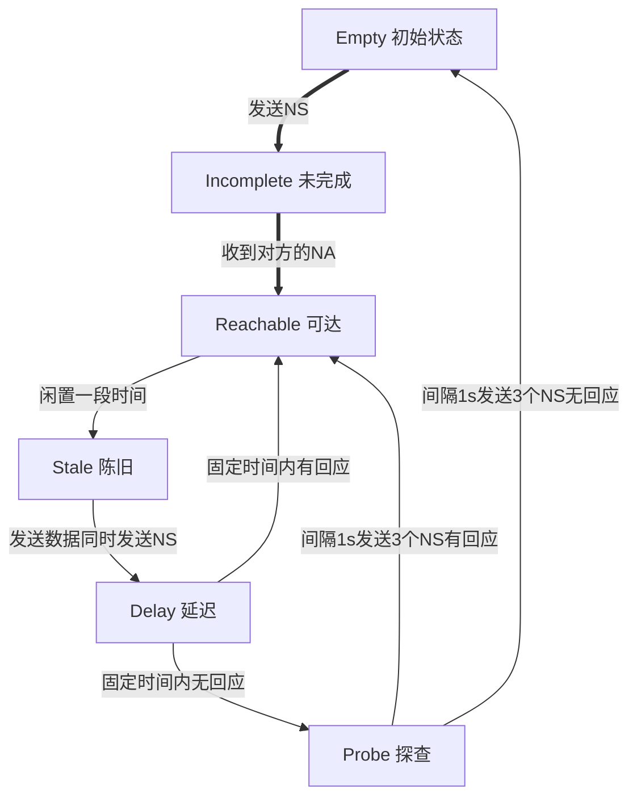
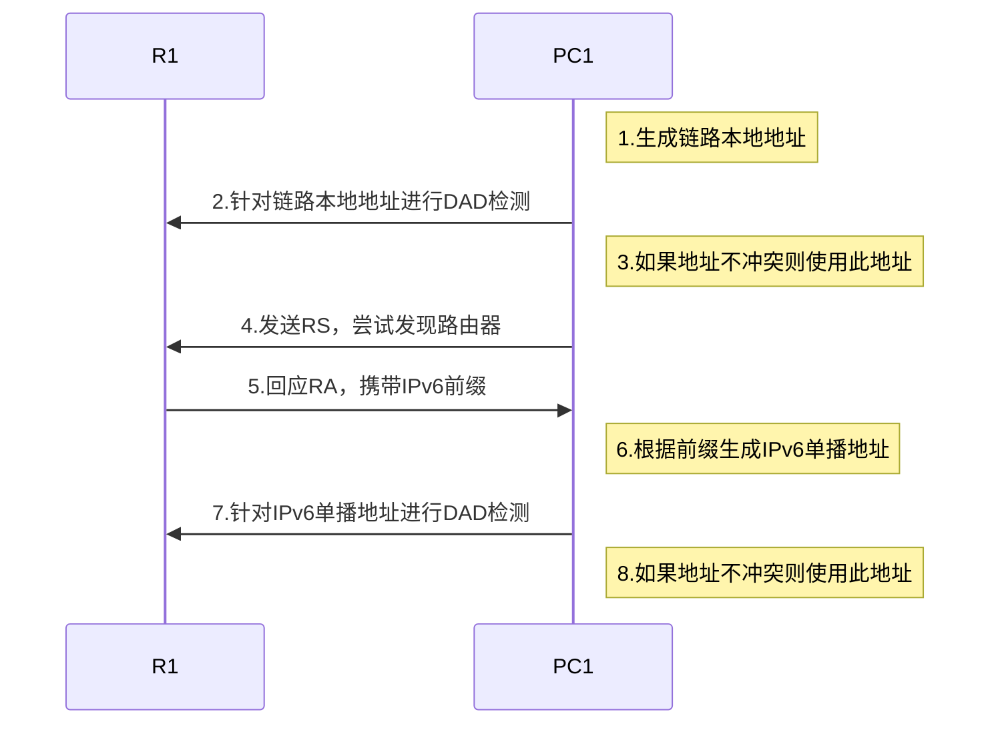
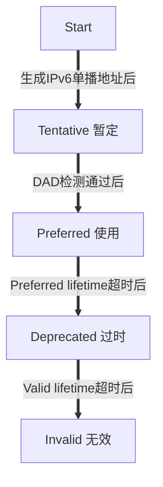

## IPv6

8*16bit，前四个16bit为网络前缀，后四个为接口标识。类似于网络号和主机号

常用压缩格式，例如：`2001:D8B:0:1::45ff/64`

### 相较于IPv4：

- **近乎无限的地址空间**：与IPv4相比，这是最明显的好处。IPv6地址是由128 bit构成，单从数量级来说，IPv6所拥有的地址容量是IPv4的约8x1028倍，号称可以为全世界的每一粒沙分配一个网络地址。这使得海量终端同时在线，统一编址管理，变为可能为万物互连提供了强有力的支撑。
- **层次化的地址结构**：正因为有了近乎无限的地址空间，IPv6在地址规划时就根据使用场景划分了各种地址段。同时严格要求单播IPv6地址段的连续性，便于IPv6路由聚合缩小IPv6地址表规模。
- **即插即用**：任何主机或者终端要获取网络资源，传输数据，都必须有明确的IP地址。传统的分配IP地址方式是手工或者DHCP自动获取，除了上述两个方式外，IPv6还支持SLAAC(Stateless Address Autoconfiquration，无状态地址自动配置)。
- **端到端网络的完整性**：大面积使用NAT技术的IPv4网络，从根本上破坏了端到端连接的完整性。使用IPv6之后，将不再需要NAT网络设备，上网行为管理、网络监管等将变得简单，与此同时，应用程序也不需要开发复杂的NAT适配代码。
- **安全性得到增强**：IPsec(Internet ProtocolSecurity，因特网协议安全协议)最初是为IPv6设计的，所以基于IPv6的各种协议报文(路由协议、邻居发现等)，都可以端到端地加密，当然该功能目前应用并不多。而IPv6的数据面报文安全性，跟IPv4+IPsec的能力，基本相同。
- **可扩展性强**：IPv6的扩展属性报文头部，并不是主数据包的一部分，但是在必要的时候，这些扩展头部会插在IPv6基本头部和有效载荷之间，能够协助IPv6完成加密功能移动功能、最优路径选路、QoS等，并可提高报文转发效率。
- **移动性改善**：当一个用户从一个网段移动到另外一个网段，传统的网络会产生经典式“三角式路由”，IPv6网络中，这种移动设备的通信，可不再经过原“三角式路由而做直接路由转发，降低了流量转发的成本，提升了网络性能和可靠性。
- **QoS可得到进一步增强**：IPv6保留了IPv4所有的QoS属性，额外定义了20Bvte的流标签字段，可为应用程序或者终端所用，针对特殊的服务和数据流，分配特定的资源，目前该机制并没有得到充分的开发和应用。

### 常用的IPv6前缀

| IPv6地址或前缀 | 含义                                       |
| -------------- | ------------------------------------------ |
| 2001::/16      | 用于IPv6 Internet，类似于IPv4公网地址      |
| 2002::/16      | 用于6to4隧道                               |
| FE80::/10      | 链路本地地址前缀，用于本地链路范围内的通信 |
| FF00::/8       | 组播地址前缀，用于IPv6组播                 |
| ::/128         | 未指定地址，类似于IPv4中的0.0.0.0          |
| ::1/128        | 环回地址，类似于IPv4中的127.0.0.1          |

***一个接口至少有三个地址，链路本地地址、全球单播地址、回送地址***

### 根据MAC地址生成接口标识的标准方法

第7个bit取反，然后在中间插入FF-FE

例如：`08-70-5A-90-1A-01`，转为`0A-70-5A-FF-FE-90-1A-01`

### 常见的地址

**GUA 全球单播地址**

相当于v4的公网地址，格式为：

前3bit为001，接下来45bit为全局路由前缀，接下来16bit为子网标识

**ULA 唯一本地地址**

IPv6私网地址，格式为：

前8bit为1111 1101，接下来40bit随机生成，接下来16bit为子网标识，常见为`FC`开头

**LLA 链路本地地址**

仅在单一链路上使用的地址，用于IPv6地址无状态自动化配置、IPv6邻居发现等

前10bit为1111 1110 10，接下来54bit固定为0，常见为：`FE80`开头

**组播地址**

FF::/8

*使用的组播MAC前16bit为33:33，后32位为IPv6地址的后32位*

**被请求节点组播地址**

PC1发送数据至PC2前，首先需要获取其MAC地址。PC1将发起类似IPv4中ARP的解析流程，IPv6使用CMPV6的NS及NA报文来实现地址解析过程，NS报文的目的IPv6地址为目标IPv6单播地址对应的被请求节点组播地址

格式为固定的`FF02::1:`开头，剩下两个16bit为目的端IP地址的尾部16bit

### IPv6头部相较于IPv4的改进
- **取消三层校验**：协议栈中二层和四层的已提供校验，因此IPv6直接取消了IP的三层校验，节省路由器处理资源
- **取消中间节点的分片功能**：中间路由器不再处理分片，只在产生数据的源节点处理，省却中间路由器为处理分片而耗费的大量CPU资源
- **定义定长的IPv6报头**：有利于硬件的快速处理，提高路由器转发效率
- **安全选项的支持**：IPv6提供了对IPSec的完美支持，如此上层协议可以省去许多安全选项
- **增加流标签**：提高QoS效率

> IPv6报头设计中对原IPv4报头所做的一项重要改进就是将所有可选字段移出IPv6报头，置于扩展头中。IPv6扩展报头是可能跟在基本IPv6报头后面的可选报头。为什么在IPv6中要设计扩展报头呢?因为在IPv4的报头中包含了所有的选项，每个中间路由器都必须检查这些选项是否存在，如果存在，就必须处理它们。这种设计方法会降低路由器转发IPv4数据包的效率。为了解决转发效率问题，在IPv6中，相关选项被移到了扩展报头中。中间路由器就不需要处理每一个可能出现的选项，这种处理方式提高了路由器处理数据包的速度，也提高了其转发性能。

### ICMPv6

ICMP(Internet Control Message Protocol 互联网控制信息协议)主要用于主机或设备报告差错情况。常用的ping、tracert都是基于这一协议实现的

ICMPv6在IPv6的报文头部中对应的Next Header字段值为58

主要涉及地址自动配置、地址解析、地址冲突检测、路由选择、差错控制

当报文类型为0-127时为差错报文，128-255为信息报文

例如：128为echo request，129为echo reply，二者配合就实现了ping功能

### NDP

邻居发现协议

主要实现：
| 功能         | 作用                                                  |
| ------------ | ----------------------------------------------------- |
| 地址解析     | 请求对应的网络层地址对应的数据链路层地址，类似v4的ARP |
| 重复地址检测 | 获得地址后进行重复检测确保地址不冲突                  |
| 路由器发现   | 发现链路上的路由器                                    |
| 前缀重编址   | 路由器对所通告的地址前缀进行灵活设置                  |
| 重定向       | 告知其他设备到达目的网络的更优下一跳                  |

涉及五类报文：
| Type号 | 简写     | 名称       |
| ------ | -------- | ---------- |
| 133    | RS       | 路由器请求 |
| 134    | RA       | 路由器公告 |
| 135    | NS       | 邻居请求   |
| 136    | NA       | 邻居公告   |
| 137    | Redirect | 重定向     |

地址解析、重复地址检测使用NS和NA实现，路由器发现、前缀重编址使用RS和RA实现

#### IPv6邻居状态

| 中文   | 状态       | 描述  |
| ------ | ---------- | ---- |
| 未完成 | Incomplete | 邻居不可达。正在进行地址解析                                                       |
| 可达   | Reachable  | 邻居可达。表示在规定时间(邻居可达时间，缺省情况下是30秒)内邻居可达                 |
| 陈旧   | Stale      | 邻居是否可达未知。表明该表项在规定时间(邻居可达时间，缺省情况下是30秒)内没有被使用 |
| 延迟   | Delay      | 邻居是否可达未知                                                                   |
| 探查   | Probe      | 已向邻居发送NS报文，间隔1s发送3个NS探测邻居是否可达                                               |

#### 路由器发现

**主机请求触发**

主机发送RS（源地址为本地链路地址，目的地址为FF02::2），路由器回复RA（源地址为本地链路地址，目的地址为FF02::1）。主机收到回复后生成缺省路由，下一跳指向缺省路由器的链路本地地址

**路由器周期发送**

路由器周期性发送RA（源地址为本地链路地址，目的地址为FF02::1）

`ipv6 nd ra { max-interval 'max-interval'| min-interval 'min-interval' }`用来配置RA报文的发送周期

#### 地址解析

用于获取邻居的数据链路层地址并生成邻居缓存表项（类似于IPv4的ARP表）

#### 重复地址检测

接口在使用某个地址前需要先探测是否存在其他节点使用了该地址，确保网络中没有两个相同的单播地址

#### 重定向

重定向是指网关设备发现报文从其它网关设备转发更优，它就会发送重定向报文告知报文的发送者，让报文发送者选择另一个网关设备

### IPv6地址配置 

#### 无状态地址自动配置

SLAAC（Stateless Address Autoconfiguration），指不需要专门的**地址分配服务器**保存和管理每个节点状态信息的地址分配方式

基于NDP实现

地址存在一定的**生存周期**：

**Preferred**：可正常收发报文
**Deprecated**：现有连接可以使用但无法建立新连接

#### 有状态地址自动配置

基于DHCPv6实现

DHCPv6分为如下三种：
1. **DHCPV6有状态自动配置**
DHCPV6服务器自动配置IPv6地址/前缀及其他网络配置参数(DNS、NIS、SNTP服务器地址等参数)

2. **DHCPv6无状态自动配置**
主机IPv6地址仍然通过路由通告方式自动生成，DHCPV6服务器只分配除IPv6地址以外的配置参数，包括DNS服务器等参数

3. **DHCPV6 PD(Prefix Delegation，前缀代理)自动配置**
下层网络路由器不需要再手工指定用户侧链路的IPv6地址前缀，它只需要向上层网络路由器提出前缀分配申请，上层网络路由器便可以分配合适的地址前缀给下层路由器，下层路由器把获得的前缀(前缀一般长度小于64)进一步自动细分成64位前缀长度的子网网段，把细分的地址前缀再通过路由通告(RA)至与IPv6主机直连的用户链路上，实现主机的地址自动配置，从而完成整个IPv6网络的层次化布局