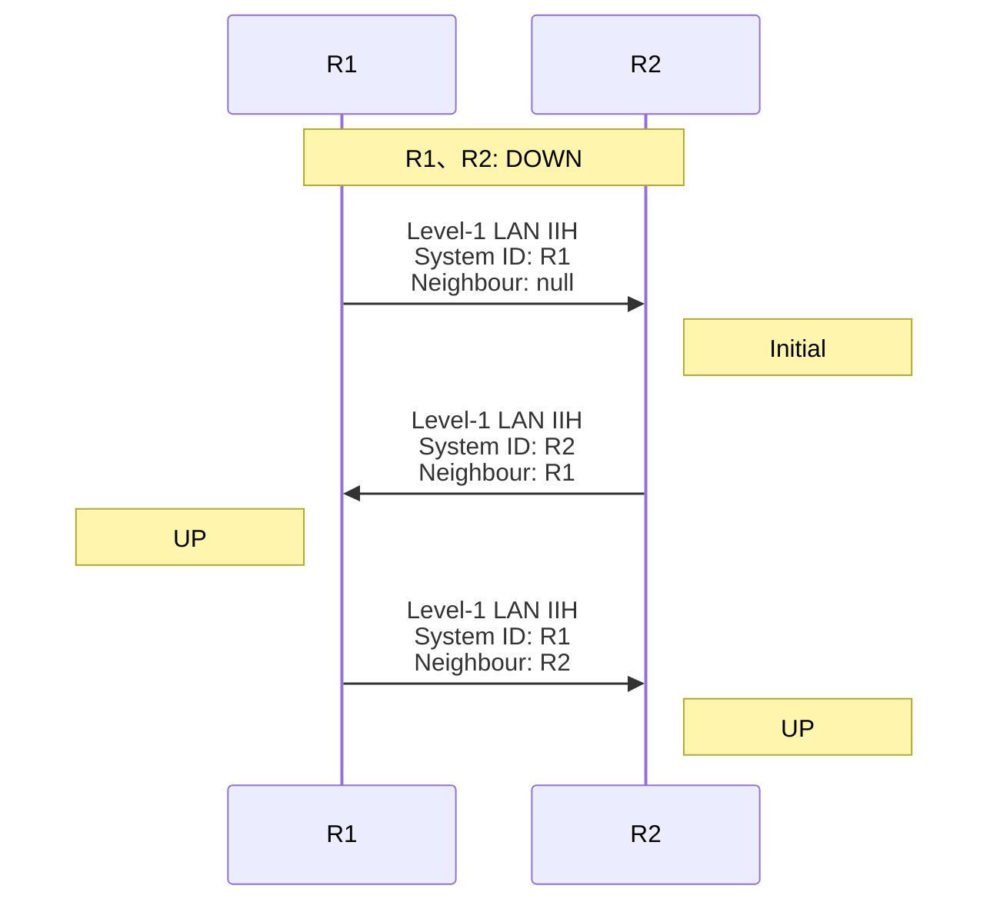
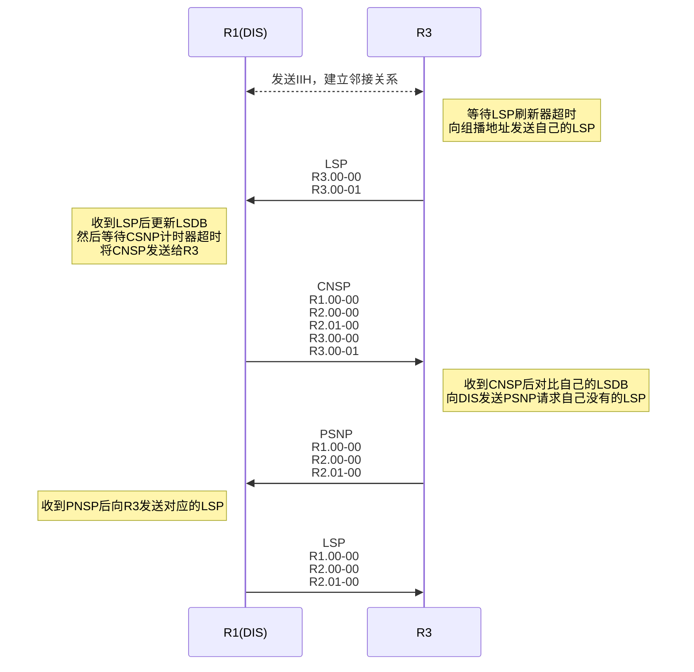

## IS-IS

### IS-IS与OSPF的不同点
- 在IS-IS中，每个路由器都只属于一个区域;而在OSPF中，一个路由器的不同接口可以属于不同的区域。
- 在IS-IS中，单个区域没有骨干与非骨干区域的概念;而在OSPF中，Area0被定义为骨干区域。
- 在IS-IS中，Level-1和Level-2级别的路由都采用SPF算法，分别生成最短路径树SPT(Shortest Path Tree);而在OSPF中，只有在同一个区域内才使用SPF算法，区域之间的路由需要通过骨干区域来转发。

### IP地址检查
IS-IS是运行在数据链路层的协议，但实际部署时，在IP网络中是需要检查对方的地址的
1. 两端的IP地址不在同一网段时，如果是点到点接口，是可以通过配置忽略IP地址检查的
2. 如果是以太网接口可以将以太网接口模拟成点到点接口，之后才能配置

### 在广播网络中的IS-IS

在广播网络中使用三次握手建立邻接关系：


#### 伪节点

是广播网络上的一个虚拟节点，并非真实的路由器。负责记录网络内所有IS-IS路由器，并同步链路状态数据库

#### DIS（Designated Intermediate System）

用来创建和更新伪节点，并负责生成伪节点的LSP

DIS的Hello报文生成间隔为普通路由器的1/3，这样为了确保DIS出现故障时可以被快速发现

##### 与OSPF中DR的区别

|情况|IS-IS中|OSPF中|
|:-:|:-:|:-:|
|优先级为0的路由器|会参与DIS的选举|不会参与DR的选举|
|有新的高优先级路由器加入网络|会成为新的DIS并引起LSP泛洪|不会立刻成为DR|
|同区域内邻接关系的建立|同一级别的路由器之间都会建立|普通路由器只与DR和BDR建立|

### 在点到点网络中的IS-IS

使用两次握手建立邻接关系，只要收到对方发来的Hello报文，就单方面宣布邻接关系为UP

*但华为设备在点到点网络中默认用三次握手*

### LSDB

`show isis lsdb`

其中LSPID形式为：`0100.0000.1001.00-00*`

- `0100.0000.1001`为System-ID
- 第一个`00`为伪节点标识，当此参数不为0时代表由伪节点产生
- 第二个`00`为分片号，当ISIS要发布的数据报文过大时就会做分片
- 结尾的`*`表示此LSP由自己产生

#### 当广播网络中新加入路由器时

广播网络中已有R1、R2，其中R1为DIS，此时有新路由器R3接入此网络：


### IS-IS常用命令

```
# 创建IS-IS进程
isis 进程号

# 配置网络实体
network-entity net号

# 配置Level级别
is-level level-{1|1-2|2}
# 缺省情况下为Level-1-2

# 引入路由（路由渗透）
address-family ipv4 # 华三设备需要先进地址族
import-route isis level-2 into level-1 # 把isis二层引入一层区域
import-route direct # 引入直连路由

# 接口视图下
[GE0/0/1] isis enable [进程号]

# 配置接口Level
[GE0/0/1] isis circuit-level level-{1|1-2|2}
# 缺省情况下为Level-1-2
# 两台Level-1-2的设备建立邻居关系时，缺省情况下会建立Level-1和2邻居关系
# 如果配置了接口的Level，就可以只建立一种Level

# 设置接口的网络类型
[GE0/0/1] isis circuit-type p2p

# 设置接口的DIS优先级
[GE0/0/1] isis dis-priority 优先级 [level-1|level-2]
```