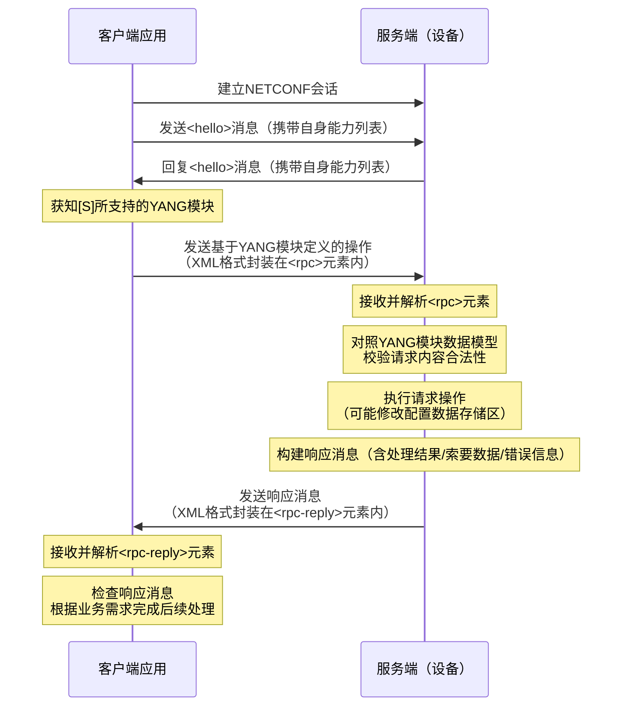

### 什么是NETCONF
网络配置协议**NETCONF**（Network Configuration Protocol）为网管和网络设备之间通信提供了一套协议，网管通过NETCONF协议对远端设备的配置进行**下发、修改和删除**等操作。网络设备提供了规范的应用程序编程接口API（Application Programming Interface），网管可以通过NETCONF使用这些API管理网络设备。
NETCONF是基于**可扩展标记语言XML**（Extensible Markup Language）的网络配置和管理协议，使用简单的基于RPC（Remote Procedure Call）机制实现客户端和服务器之间通信。客户端可以是脚本或者网管上运行的一个应用程序。服务器是一个典型的网络设备。

### NETCONF的协议框架
```
  Layer                                 Example

 Content             Configuration Data          Notification Data
    |                       |                           |
Operations           <edit-config>,etc                  |
    |                       |                           |
 Messages            <rpc>,<rpc-reply>           <notification>
    |                       |                           |
Secure-Transport         SSH,TLS,BEEP/TLS,SOAP/HTTP/TLS,etc
```
NETCONF协议划分为四层：由低到高分别为**安全传输层**、**消息层**、**操作层**和**内容层**。

1. **安全传输层**：提供了客户端和服务器之间的通信路径。NETCONF协议可以使用任何符合基本要求的**传输层协议**承载。NETCONF传输层首选推荐SSH协议，XML信息通过SSH协议承载。

2. **消息层**：提供一种简易的不依赖于传输层，生成**RPC和通知消息**框架的通信协议。客户端把RPC请求封装在一个<rpc>元素内，发送给服务器；服务器把请求处理的结果封装在一个<rpc-reply>元素内，回应给客户端。

3. **操作层**：定义一组基本的操作，作为**RPC的调用方法**，可以使用XML编码的参数调用这些方法。

4. **内容层**：由管理数据内容的**数据模型**定义。目前主流的数据模型有Schema模型、YANG模型等。
   - **Schema**是为了描述XML文档而定义的一套规则。设备通过Schema文件向网管提供配置和管理设备的接口。Schema文件类似于SNMP的MIB文件。
   - **YANG**是专门为NETCONF协议设计的数据建模语言。客户端可以将RPC操作编译成XML格式的报文，XML遵循YANG模型约束进行客户端和服务器之间通信。

### 配置数据库
所谓配置数据库是关于设备的一套完整的配置参数的集合。NETCONF定义了一个或多个配置数据库的存在，并允许对它们进行配置操作。

NETCONF基本模型中只存在`<running/>`配置数据库。 其他配置数据库可以由能力集定义，且只在宣称支持该能力集的设备上可用。

- `<running/>`：**运行配置数据库**，保存网络设备上当前处于活动状态的完整配置。
在设备上只存在一个此类型的配置数据库，并且始终存在。

- `<candidate/>`：**备用配置数据库**，存放设备将要提交到`<running/>`的各项配置数据的集合。管理员可以在`<candidate/>`上进行操作，对`<candidate/>`的任何改变不会直接影响网络设备。可以通过`<commit>`指令将备用配置数据提交为设备运行数据。

- `<startup/>`：**启动配置数据库**，存放设备启动时所加载的配置数据，相当于已保存的配置文件。


### RPC操作
RFC6244文件中定义了一系列**RPC操作**如下：

| 操作          | 描述                                      |
|:-------------:|------------------------------------------|
| commit        | 将“候选配置”提交到“运行配置”               |
| copy-config   | 将一个配置数据库的数据拷贝到另一个配置数据库 |
| delete-config | 用来删除一个配置数据库                     |
| edit-config   | 修改配置数据存储的内容                     |
| get-config    | 获取配置数据存储的全部或部分内容            |
| lock          | 用来锁定指定的配置数据库                   |
| unlock        | 释放对该配置数据库的锁定                   |
| close-session | 用来正常关闭当前NETCONF会话                |
| kill-session  | 用来强制关闭一个NETCONF会话，需要管理员权限 |

### NETCONF基本网络架构
RFC6244文件中给出了NETCONF-YANG的网络架构图：
```
                       +----------------------------+
                       |Server (device)             |
                       |    +--------------------+  |
                       |    |      configuration |  |
            +----+     |    |     ---------------|  |
            |YANG|+    |    | m d  state data    |  |
            |mods||+   |    | e a ---------------|  |
            +----+|| -----> | t t  notifications |  |
             +----+|   |    | a a ---------------|  |
              +----+   |    |      operations    |  |
                       |    +--------------------+  |
                       |           ^                |
                       |           |                |
                       |           v                |
     +------+          |     +-------------+        |
     |      | -------------> |             |        |
     |Client| <rpc>    |     |  NETCONF    |        |
     | (app)|          |     |   engine    |        |
     |      | <------------  |             |        |
     +------+ <rpc-reply>    +-------------+        |
                       |       /        \           |
                       |      /          \          |
                       |     /            \         |
                       | +--------+   +---------+   |
                       | | config |   |system   |+  |
                       | |  data- |   |software ||+ |
                       | |   base |   |component||| |
                       | +--------+   +---------+|| |
                       |               +---------+| |
                       |                +---------+ |
                       +----------------------------+
```
这个架构中的主要元素有：
1. **客户端（Client）**，主要作用如下：
    - 利用NETCONF协议对网络设备进行系统管理。
    - 向NETCONF Server发送**RPC请求**，查询或修改一个或多个具体的参数值。
    - 接收NETCONF Server主动发送的**告警和事件**，以获知被管理设备的当前状态。
2. **服务器（Server）**，主要用于维护被管理设备的信息数据并响应客户端的请求。
    - NETCONF Server收到Client的**请求**后会进行数据解析，然后给NETCONF Client返回响应。
    - 当设备发生故障或其他事件时，NETCONF Server利用Notification机制主动将设备的**告警和事件**通知给Client，向Client报告设备的当前状态变化。

### NETCONF会话流程
常见的NETCONF流程通常如下：



