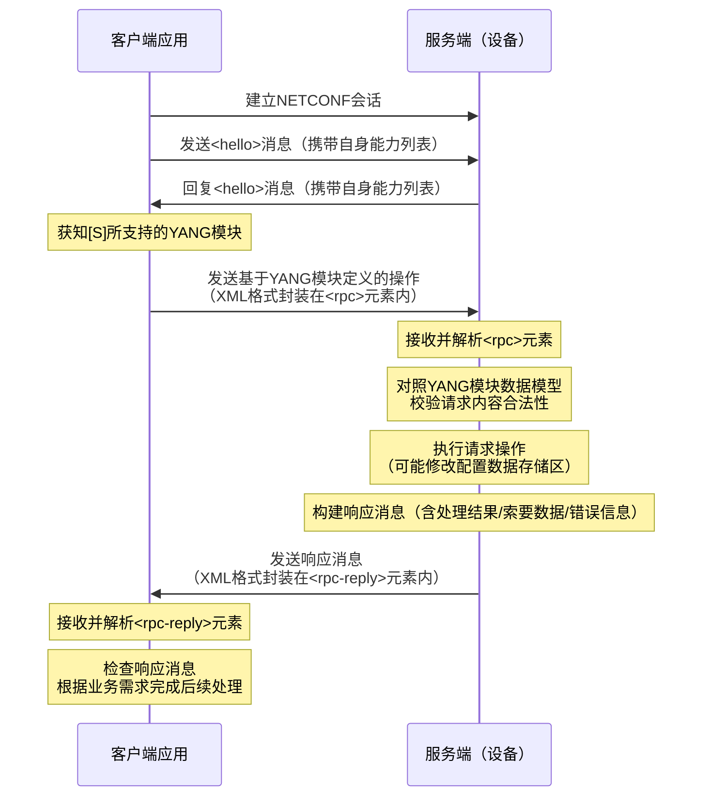

### NETCONF基本网络架构
RFC6244文件中提供了NETCONF-YANG的网络架构图：
```
                       +----------------------------+
                       |Server (device)             |
                       |    +--------------------+  |
                       |    |      configuration |  |
            +----+     |    |     ---------------|  |
            |YANG|+    |    | m d  state data    |  |
            |mods||+   |    | e a ---------------|  |
            +----+|| -----> | t t  notifications |  |
             +----+|   |    | a a ---------------|  |
              +----+   |    |      operations    |  |
                       |    +--------------------+  |
                       |           ^                |
                       |           |                |
                       |           v                |
     +------+          |     +-------------+        |
     |      | -------------> |             |        |
     |Client| <rpc>    |     |  NETCONF    |        |
     | (app)|          |     |   engine    |        |
     |      | <------------  |             |        |
     +------+ <rpc-reply>    +-------------+        |
                       |       /        \           |
                       |      /          \          |
                       |     /            \         |
                       | +--------+   +---------+   |
                       | | config |   |system   |+  |
                       | |  data- |   |software ||+ |
                       | |   base |   |component||| |
                       | +--------+   +---------+|| |
                       |               +---------+| |
                       |                +---------+ |
                       +----------------------------+
```
这个架构中的主要元素有：
1. 客户端（Client），主要作用如下：
    - 利用NETCONF协议对网络设备进行系统管理。
    - 向NETCONF Server发送**RPC请求**，查询或修改一个或多个具体的参数值。
    - 接收NETCONF Server主动发送的**告警和事件**，以获知被管理设备的当前状态。
2. 服务器（Server），主要用于维护被管理设备的信息数据并响应客户端的请求。
    - NETCONF Server收到Client的**请求**后会进行数据解析，然后给NETCONF Client返回响应。
    - 当设备发生故障或其他事件时，NETCONF Server利用Notification机制主动将设备的**告警和事件**通知给Client，向Client报告设备的当前状态变化。


### NETCONF会话流程
常见的NETCONF流程通常如下：



