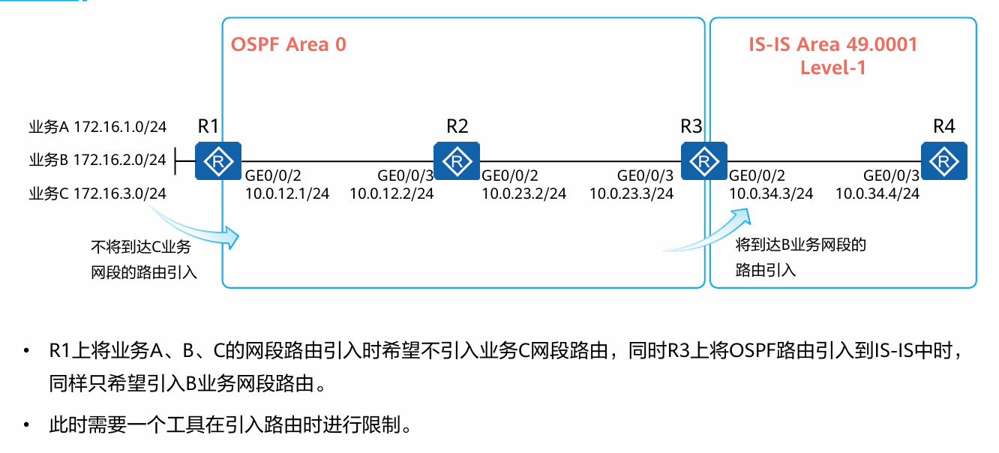

## 路由策略与路由控制

路由策略并非单一的技术或协议，而是一个技术专题或方法论

常用的路由选择工具：ACL、IP-Prefix、Filter-Policy、Route-Policy

### 技术背景



路由策略（Route-Policy）可以在控制路由的发布、接收、引入等操作

所以需要提前定义一组匹配原则用来**匹配路由**，用另一部分工具来**过滤路由**

### 匹配工具1：ACL

访问控制列表（Access Control List）

定义通常如下：
```
acl number 2000
  rule 5 permit source 1.1.1.0 0.0.0.255
  rule 10 deny source 2.2.2.0 0.0.0.255
```
permit、deny代表允许和拒绝

最后的通配符，`0`标识匹配，`1`标识无需匹配

在制定规则是还可以指定time-range令其生效的时间段可控，time-range也在system-view视图下创建并指定起止时间

*华三设备的命令是acl basic 2000，basic代表基础ACL*

**ACL的分类**

|分类|编号范围|规则定义描述|
|-|-|-|
|基本ACL|2000~2999|仅使用报文的源IP地址、分片信息和生效时间段信息来定义规则。|
|高级ACL|3000~3999|可使用IPv4报文的源IP地址、目的IP地址、IP协议类型、ICMP类型、TCP源/目的端口、UDP源/目的端口号、生效时间段等来定义规则。|
|二层ACL|4000~4999|使用报文的以太网帧头信息来定义规则，如根据源MAC地址、目的MAC地址、二层协议类型等。|
|用户自定义ACL|5000~5999|使用报文头、偏移位置、字符串掩码和用户自定义字符串来定义规则。|
|用户ACL|6000~6999|既可使用IPV4报文的源IP地址或源UCL(User ControlList)组，也可使用目的IP地址或目的UCL组、IP协议类型、ICMP类型、TCP源端口/目的端口、UDP源端口/目的端口号等来定义规则。|

*对于使用ACL进行路由匹配的场景，用户只能使用基本ACL*

**ACL匹配机制**

一旦匹配立即停止，即1规则拒绝此IP段，2规则允许此IP段，那么在规则1匹配时则立即停止，最终拒绝此IP

也就是说规则号更小的规则优先级越高

*华为设备也支持配置为深度优先排序，即精确度越高的规则优先级越高*

### 匹配工具2：IP前缀列表

**创建ip前缀列表**

华为命令：`ip ip-prefix 1 permit 172.16.0.0 16 greater-equal 24 less-equal 24`
华三命令：`ip prefix-list 1 permit 172.16.0.0 16 greater-equal 24 less-equal 24`

前缀列表是匹配路由条目用的，不是匹配具体IP用的，因此要关注掩码长度

其中`greater-equal、less-equal`代表掩码长度的范围，例如：

ip ip-prefix List1 index 10 permit1.1.1.0 24 greater-equal 24 less-equal 27

上述IP前缀列表匹配的是网络地址的前24bit与1.1.1.0相同，网络掩码长度大于或等于24且小于或等于27的路由
因此1.1.1.1/32即使前24位与1.1.1.0相同，最终结果也是不匹配。

*注：ip-prefix和acl都是匹配即停，且默认拒绝未匹配的流量*

### 策略工具1：Filter-Policy

可应用于IS-IS、OSPF、BGP等协议，当路由传递时可以使用此工具进行过滤，可以配置import/export来控制入/出路由

需要注意的是Filter-Policy仅能过滤路由信息而无法过滤LSA信息

例如在OSPF中，Filter-Policy仅能对OSPF计算出来的路由，在加载到路由表之前进行过滤，而不会对LSA进行过滤

也就是说ip routing-table里面没有，但是ospf lsdb里面有

**使用场景-OSPF**

filter-policy import命令对接收的路由设置过滤策略，只有通过过滤策略的路由才被添加到路由表中，没有通过过滤策略的路由不会被添加进路由表，但不影响对外发布出去。

OSPF通过命令import-route引入外部路由后，为了避免路由环路的产生，通过filter-policy export命令对引入的路由在发布时进行过滤，只将满足条件的外部路由转换为Type5LSA(AS-external-LSA)并发布出去。

### 策略工具2：Route-Policy

用于过滤路由信息，以及为过滤后的路由信息设置路由属性

一个route-policy由多个node组成，每个node由一系列条件语句和执行语句组成

每个node之间是`或`关系（即也是从小到大，匹配即停），每个node内的语句之间是`与`关系

通常形式为：

```
route-policy PolicyName permit node 10
  if-match acl cost interface ip-prefix
  apply cost cost-type (ip-address next-hop) preference tag
```
apply用于为符合的路由设置属性


