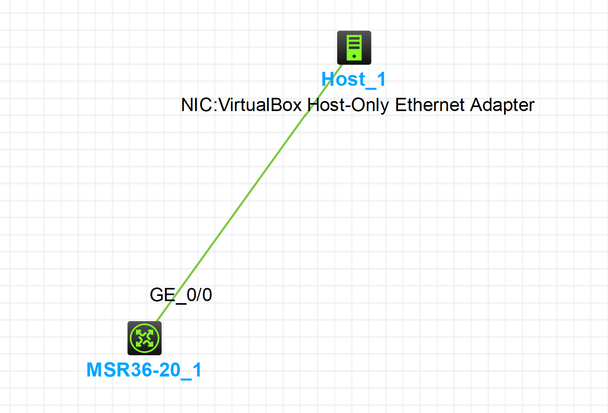

选择**HCL新华三云实验室**作为实验环境，`pysnmp`版本为`7.1.22`

### 拓扑图


将**MSR36**设备与主机网络`192.168.56.0/24`对接，IP地址配置为`192.168.56.101/24`

### 配置设备

**SNMPv3**支持**RBAC**（基于角色）和**VACM**（基于视图）两种访问控制模式：

**RBAC模式**：
```bash
system-view

role name test
 # 只能读节点snmpMIB（OID为1.3.6.1.6.3.1）下的对象
 rule 1 permit read oid 1.3.6.1.6.3.1
 # 具有system（OID为1.3.6.1.2.1.1）的读权限
 rule 2 permit read oid 1.3.6.1.2.1.1
 # 具有interfaces（OID为1.3.6.1.2.1.2）的读写权限
 rule 3 permit read write oid 1.3.6.1.2.1.2
 quit

# 创建用户RBACtest，为其绑定用户角色test，同时设置好认证和加密信息
snmp-agent usm-user v3 RBACtest user-role test simple authentication-mode sha 123456TESTauth&! privacy-mode aes128 123456TESTencr&!
```
**VACM模式**：
```bash
system-view

# 删除默认设置的视图
undo snmp-agent mib-view ViewDefault
snmp-agent mib-view included test snmpMIB
snmp-agent group v3 managev3group privacy read-view test
# 配置用户具有system（OID为1.3.6.1.2.1.1）和interfaces（OID为1.3.6.1.2.1.2）的读写权限
snmp-agent mib-view included test 1.3.6.1.2.1.1
snmp-agent mib-view included test 1.3.6.1.2.1.2
snmp-agent group v3 managev3group privacy read-view test write-view test

# 创建用户名为VACMtest，令其加入managev3group组，同时设置好认证和加密信息
snmp-agent usm-user v3 VACMtest managev3group simple authentication-mode sha 123456TESTauth&! privacy-mode aes128 123456TESTencr&!
```

### 利用脚本查询节点信息
```python
import asyncio
from pysnmp.hlapi.v3arch.asyncio import *


async def run(varBinds):
    snmpEngine = SnmpEngine()
    while True:
        errorIndication, errorStatus, errorIndex, varBindTable = await get_cmd(
            snmpEngine,
            UsmUserData(
                    userName="RBACtest",
                    authKey="123456TESTauth&!",
                    privKey="123456TESTencr&!",
                    authProtocol=usmHMACSHAAuthProtocol,
                    privProtocol=usmAesCfb128Protocol
             ),
            await UdpTransportTarget.create(("192.168.56.101", 161)),
            ContextData(),
            *varBinds
        )

        if errorIndication:
            print("Error:")
            print(errorIndication)
            break
        elif errorStatus:
            print(
                f"{errorStatus.prettyPrint()} at {varBinds[int(errorIndex) - 1][0] if errorIndex else '?'}"
            )
        else:
            for varBind in varBindTable:
                print(" = ".join([x.prettyPrint() for x in varBind]))

        varBinds = varBindTable
        if is_end_of_mib(varBinds):
            break
    return

obj_1 = ObjectType(ObjectIdentity("1.3.6.1.2.1.2.2.1.7.2")) # 对应GE0/1的ifAdminStatus
obj_2 = ObjectType(ObjectIdentity("1.3.6.1.2.1.2.2.1.6.2")) # 对应GE0/1的物理地址

asyncio.run(
    run([obj_1, obj_2])
)
```
> 如果报错：`Ciphering services not available`说明缺少加密库支持，通过`pip install pycryptodome cryptography`大概率可以解决

**运行结果**：
```bash
SNMPv2-SMI::mib-2.2.2.1.7.2 = 1
SNMPv2-SMI::mib-2.2.2.1.6.2 = 0x4c0ee7560106
```
**分析**
可以在设备侧通过`show snmp-agent mib-node`获取MIB节点的信息或者`disp snmp-agent mib-node verbose`查看更详细的内容

也可以在命令后接`> mib-node.txt`将结果存在设备上，然后利用SFTP协议再下载为本地文档，方便查阅

通过查找文档内容，可以看到：
```txt
Name          |ifAdminStatus
OID           ||1.3.6.1.2.1.2.2.1.7 
Properties    ||NodeType:   Column
              ||AccessType: RW
              ||DataType:   Integer
              ||MOR:        0x01080207
Parent        ||ifEntry
First child   || 
Next leaf     ||ifOperStatus
Next sibling  ||ifOperStatus
Allow         ||get/set/getnext
Index         ||[indexImplied:0, indexLength:1]:
Value range   ||
              ||  ['up', 1]
              ||  ['down', 2]
              ||  ['testing', 3]
```
脚本的结果中：
`SNMPv2-SMI::mib-2.2.2.1.7.2 = 1`说明**GE0/1**的`ifAdminStatus`为`up`
`SNMPv2-SMI::mib-2.2.2.1.6.2 = 0x4c0ee7560106`代表物理地址为`0x4c0ee7560106`

通过`show interface ge 0/1`可以看到
```bash
GigabitEthernet0/1
Current state: DOWN # 这是端口上没有物理连线导致的DOWN
Line protocol state: DOWN
Description: GigabitEthernet0/1 Interface
...
IP packet frame type: Ethernet II, hardware address: 4c0e-e756-0106 # 与脚本查询到的结果一致
```

### 使用脚本更改节点内容

由`ifAdminStatus`的`AccessType: RW`属性可以了解到它是可读写的，接下来我们尝试对**GE0/1**进行**强制关闭**操作

首先我们将设备的**GE0/1**端口随便连到一个运行着的设备上，看下此时该端口的状态：
```bash
<H3C>show int ge 0/1 br
Brief information on interfaces in route mode:
Link: ADM - administratively down; Stby - standby
Protocol: (s) - spoofing
Interface            Link Protocol Primary IP      Description                
GE0/1                UP   UP       --      
```
可以看到这个端口是能正常**UP**的

**编写脚本**

与Get操作类似，只是需要在`ObjectIdentity`中传入要配置的参数
```python
import asyncio
from pysnmp.hlapi.v3arch.asyncio import *
    
async def set_node(varBinds):
    snmpEngine = SnmpEngine()
    
    errorIndication, errorStatus, errorIndex, varBindTable = await set_cmd(
        snmpEngine,
        UsmUserData(
            userName="RBACtest",
            authKey="123456TESTauth&!",
            privKey="123456TESTencr&!",
            authProtocol=usmHMACSHAAuthProtocol,
            privProtocol=usmAesCfb128Protocol
        ),
        await UdpTransportTarget.create(("192.168.56.101", 161)),
        ContextData(),
        *varBinds
    )

    if errorIndication:
        print(f"错误: {errorIndication}")
    elif errorStatus:
        print(f"SNMP 错误: {errorStatus.prettyPrint()} at "
              f"{varBinds[int(errorIndex) - 1][0] if errorIndex else '?'}")
    else:
        print("设置成功！")
        for varBind in varBindTable:
            print(" = ".join([x.prettyPrint() for x in varBind]))

# 将GE0/1接口的管理状态设置为down(2)
obj_setted = ObjectType(ObjectIdentity("1.3.6.1.2.1.2.2.1.7.2"), Integer(2)) 

asyncio.run(
    set_node([obj_setted])
)
```

**运行结果**
```bash
<H3C>%Feb 14 14:07:56:994 2026 H3C IFNET/3/PHY_UPDOWN: Physical state on the interface GigabitEthernet0/1 changed to down.
%Feb 14 14:07:56:994 2026 H3C IFNET/5/LINK_UPDOWN: Line protocol state on the interface GigabitEthernet0/1 changed to down.
show int ge 0/1 br
Brief information on interfaces in route mode:
Link: ADM - administratively down; Stby - standby
Protocol: (s) - spoofing
Interface            Link Protocol Primary IP      Description                
GE0/1                ADM  DOWN     --              # 接口已被管理关闭
```