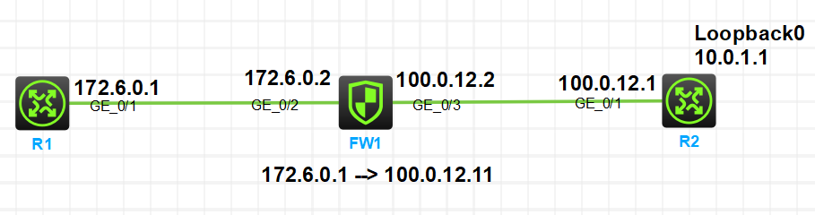

## 常见的安全加固策略

网络设备可能收到的攻击有恶意登录、伪造大量控制报文两类

**常见的加固策略**
1. 关闭不使用的业务和协议端口
2. 废弃不安全的访问通道
3. 基于可信路径的访问控制
4. 本机防攻击

### 批量关闭不使用的接口

```
[H3C]interface range GigabitEthernet 1/0/1 to GigabitEthernet 1/0/34 
[H3C-if-range]shutdown 

[HW]port-group gp1
[HW-port-group-gp1]group-member GigabitEthernet 1/0/1 to GigabitEthernet 1/0/34
[HW-port-group-gp1]shutdown
```

### 废弃不安全的访问通道

例如把Telnet改为SSH v2，FTP改为SFTP，SNMP v1/v2改为SNMP v3，HTTP改为HTTPS

### 基于可信路径的访问控制

即在**接口1**收到报文时，检查报文的源地址（例如为**PC1**），对照路由表检查去往**PC1**的接口是否为**接口1**，如果不是**接口1**则有可能为恶意设备伪造报文的源地址

### 本机防攻击

本机防攻击主要为保护设备的CPU占用率，包括CPU防攻击和攻击溯源两部分：

1. **CPU防攻击**是指设置阈值，在单位时间内对上送CPU的报文数量进行限制
2. **攻击溯源**主要针对DoS攻击进行防御，对超过阈值的报文分析，找出攻击源用户或端口，然后针对源用户或端口采取措施，例如直接丢弃报文

*缺省情况下，SSH报文、Telnet报文、SSHv6报文、Telnetv6报文、HTTP报文、BGP报文的动态链路保护功能的限制速率是512pps，FTP报文的动态链路保护功能的限制速率是1024pps*

### 配置SSH登录
```
[SSH-Server]ssh server enable 

[SSH-Server]line vty 0 4 # user-interface和line是同一个命令
[SSH-Server-line-vty0-4]authentication-mode scheme 
[SSH-Server-line-vty0-4]protocol inbound ssh
[SSH-Server-line-vty0-4]quit

[SSH-Server]local-user zzy class manage 
New local user added.
[SSH-Server-luser-manage-zzy]password simple aaa123456789
[SSH-Server-luser-manage-zzy]service-type ssh 
[SSH-Server-luser-manage-zzy]authorization-attribute user-role network-admin 
[SSH-Server-luser-manage-zzy]authorization-attribute user-role network-operator 
[SSH-Server-luser-manage-zzy]quit

# 可使用acl进行访问控制
[SSH-Server]acl basic 2000
[SSH-Server-acl-ipv4-basic-2000]rule 0 permit source 192.168.56.1 0
[SSH-Server-acl-ipv4-basic-2000]quit
[SSH-Server]ssh server acl 2000

# 华三设备生成密钥对
[H3C] public-key local create rsa

# 华为设备生成密钥对
[HW] rsa local-key-pair create
```

### 记录下自己做了下防火墙NAT转换

*环境：HCL*

**实验目标**

实现R1访问R2的Loopback地址时源地址能从172.6.0.1转换为100.0.12.11

[点此处查看配置文件](实验中用到的配置/防火墙NAT转换/)

**拓扑图**



#### 步骤

**配置设备上的端口IP，防火墙的安全区域**

R1、R2略

FW1
```bash
interface GigabitEthernet1/0/2
 ip address 172.6.0.2 255.255.255.0

interface GigabitEthernet1/0/3
 ip address 100.0.12.2 255.255.255.0

security-zone name Trust
 import interface GigabitEthernet1/0/2

security-zone name Untrust
 import interface GigabitEthernet1/0/3
```

**在设备上配置静态路由**

R1
```bash
ip route-static 0.0.0.0 0 172.6.0.2
```

FW1
```bash
ip route-static 10.0.1.1 32 100.0.12.1
ip route-static 100.0.12.0 24 100.0.12.2
ip route-static 172.6.0.0 24 172.6.0.2
```

R2
```bash
ip route-static 0.0.0.0 0 100.0.12.2
```

**在FW上配置安全相关内容**

```bash
# 配置nat地址组
nat address-group 1
 address 100.0.12.11 100.0.12.11

# 配置acl放通R1发送的报文
acl basic 2000
 rule 0 permit source 172.6.0.0 0.0.0.255

# 在防火墙出接口上配置nat转换
# 将源地址转为address-group 1中的ip
interface GigabitEthernet1/0/3
 nat outbound 2000 address-group 1

# 配置NAT策略
nat global-policy
 rule name 1
  source-zone trust
  destination-zone untrust
  source-ip host 172.6.0.1
  action snat address-group 1

# 配置安全策略
# 放通可信和不可信区域间流量（实际上不能这么配置，仅实验使用）
security-policy ip
 rule 0 name 1
  action pass
  source-zone trust
  source-zone untrust
  destination-zone untrust
  destination-zone trust
 rule 1 name any
  action pass
```

**观察防火墙上的nat session**

```bash
# 在R1上长ping10.0.1.1
[R1]ping -c 9999 10.0.1.1

# 在防火墙上观察
[FW1]show nat session verbose 
Total number of sessions on all slots: 1
Slot 1:
Initiator:
  Source      IP/port: 172.6.0.1/251
  Destination IP/port: 10.0.1.1/2048
  DS-Lite tunnel peer: -
  VPN instance/VLAN ID/Inline ID: -/-/-
  Protocol: ICMP(1)
  Inbound interface: GigabitEthernet1/0/2
  Source security zone: Trust
  NAT global policy: 1
Responder:
  Source      IP/port: 10.0.1.1/1
  Destination IP/port: 100.0.12.11/0 # 看这里，可以看到回复的报文目的地址已经被转换了
  DS-Lite tunnel peer: -
  VPN instance/VLAN ID/Inline ID: -/-/-
  Protocol: ICMP(1)
  Inbound interface: GigabitEthernet1/0/3
  Source security zone: Untrust
  NAT global policy: 1
State: ICMP_REPLY
Application: ICMP(Service name:ICMP)
Rule ID: 0
Rule name: 1   
Start time: 2025-03-12 18:23:10  TTL: 29s
Initiator->Responder:                      0 packets                    0 bytes
Responder->Initiator:                      0 packets                    0 bytes
               
Total sessions found: 1
```
在FW1--R2的连线上抓包也可以看到地址的转换情况