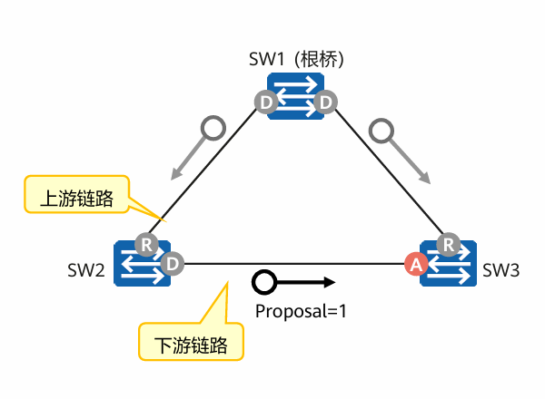
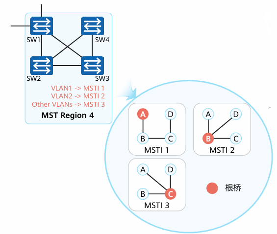

## RSTP、MSTP

STP：生成树协议

RSTP：快速生成树协议

### STP的工作原理

BPDU（Bridge Protocol Data Unit，桥协议数据单元）

**STP基本原理**
在一个具有物理环路的交换网络中，交换机通过运行STP，自动生成一个没有环路的工作拓扑，也被称为STP树。树节点为某些特定的交换机，树枝为某些特定的链路。

**STP采用四个步骤来解决二层环路问题(生成一棵STP树)**
1. 在一个交换网络中选举一个根桥
2. 在每个非根桥上选举一个根端口
3. 为每个网0段选举一个指定端口
4. 阻塞交换机上所有剩余的非根、非指定端口(备用端口)。

**STP的不足**
- STP没有细致区分端口状态和端口角色，不利于初学者学习及部署
  - 从用户角度来讲，Listening、Learning和Blocking状态并没有区别，都同样不转发用户流量
  - 从使用和配置角度来讲，端口之间最本质的区别并不在于端口状态，而是在于端口扮演的角色
- STP算法是被动的算法，依赖定时器等待的方式判断拓扑变化，收敛速度慢
- STP算法要求在稳定的拓扑中，根桥主动发出配置BPDU报文，而其他设备再进行处理，最终传遍整个STP网络

### RSTP的改进

RSTP对STP的改进:
1. 通过端口角色的增补，简化了生成树协议的理解及部署
2. 端口状态的重新划分
3. 配置BPDU格式的改变，充分利用了STP协议报文中的Flag字段，明确了端口角色
4. 配置BPDU的处理发生变化
5. 快速收敛
6. 增加保护功能

#### 四种端口角色

**根端口**：每台交换机去往根桥的最佳路线
**指定端口**：同一个桥上指定的唯一出口
**替代端口（Alternate）**：根端口的备份端口，它和其他设备的指定端口在拓扑上是互联的
**备份端口（Backup）**：同一台设备上指定端口的备份端口，它和自己的指定端口在拓扑上是互联的

#### 三种端口状态

**Discarding状态**：不转发用户流量也不学习MAC地址
**Learning状态**：不转发用户流量但是学习MAC地址
**Forwarding状态**：既转发用户流量又学习MAC地址

#### 与STP在报文上的区别

- Type：RSTP为2，STP为0，STP设备收到RSTP报文会丢弃
- Flag：使用了原来保留的6位

**拓扑稳定后，配置BPDU报文的发送方式**

**RSTP对配置BPDU的发送方式进行了改进**

在拓扑稳定后，无论非根桥设备是否接收到根桥传来的配置BPDU报文，非根桥设备仍然按照Hello Time规定的时间间隔发送配置BPDU，该行为完全由每台设备自主进行

STP拓扑稳定后，根桥按照Hello Time规定的时间间隔发送配置BPDU。其他非根桥设备在收到上游设备发送过来的配置BPDU后，才会触发发出配置BPDU，此方式使得STP计算复杂且缓慢

**更短的BPDU超时时间**

如果一个端口在超时时间(即三个周期，超时时间=Hello Time*3)内没有收到上游设备发送过来的配置BPDU，那么该设备认为与此邻居之间的协商失败

STP需要先等待一个Max Age

**处理次优BPDU**

当一个端口收到上游的指定桥发来的RST BPDU报文时，该端口会将自身缓存的RST BPDU与收到的RST BPDU进行比较，如果该端口缓存的RST BPDU优于收到的RSTBPDU，那么该端口会直接丢弃收到的RSTBPDU立即回应自身缓存的RST BPDU，从而加快收敛速度

STP协议只有指定端口会立即处理次优BPDU

**Proposal/Agreement机制**

简称P/A机制

RSTP通过 P/A机制加快了上游端口进入Forwarding状态的速度

在RSTP中，当一个端口被选举成为指定端口之后会先进入Discarding状态，再通过P/A机制快速进入Forwarding状态

在STP中，该端口至少要等待一个Forward Delay(Learning)时间才会进入到Forwarding状态

### RSTP的工作流程

1. 每一台交换机都认为自己是根桥并发送RSTP，同时把每台设备都设为指定端口/Discarding状态
2. 各设备间进行P/A协商，桥ID更优的设备成为根桥，根桥（指定端口）<-->（根端口）非根桥交换机


### RSTP常用命令

```
# 配置stp工作模式
stp mode {stp|rstp|mstp}

# 配置当前设备为根桥
stp root primary

# 配置交换机优先级
stp priority 0~61440 # 默认为32768

# 在接口视图下配置接口为边缘接口
stp edged-port enable
```

### MSTP

多生成树协议，建立多棵无环路的树，解决广播风暴并实现冗余备份

RSTP的不足：

- 流量无法分担
- 存在二层次优路径

MSTP可以将一个或多个VLAN映射到一个Instance（实例），基于Instance建立生成树，映射到同一个Instance的VLAN共享同一棵生成树。

换句话说就是流量没有冲突的VLAN之间并不需要防止环路

#### MSTP域

MSTP把一个交换网络划分为多个MSTP域，每个域内形成一棵或多棵生成树

同一个域内：
1. 都启动了MSTP
2. 具有相同的域名
3. 具有相同的VLAN和实例之间的映射配置
4. 具有相同的MSTP修订级别配置



在一个域内配置多个实例，每个实例对应一棵生成树，每棵生成树有不同的根桥

*每个VLAN只能配置到一个实例上，一个实例可以对应多个VLAN*

#### 特殊的树

**公共生成树 CST**

是连接交换网络中所有MST域的一棵树，如果把每个MST域看成节点，CST就是这些节点形成的生成树

**内部生成树 IST**

连接每个域内所有设备的一棵生成树，对应的实例为Instance 0

**公共和内部生成树 CIST**

连接网络内所有设备的一棵生成树

**单生成树 SST**

当一个域内只有一台设备时生成的树

**总根**：CIST的根桥
**域根**：IST中距离总根最近的交换设备
**主桥**：域内距离总根最近的交换设备，实际上就是总根+域根

#### 端口角色

**根端口**

在非根桥上，离根桥最近的端口是本交换设备的根端口。根端口负责向树根方向转发数据
**指定端口**

对一台交换设备而言，它的指定端口是向下游交换设备转发BPDU报文的端口

**Alternate端口**

从配置BPDU报文发送角度来看，Alternate端口就是由于学习到其它网桥发送的配置BPDU报文而阻塞的端口。从用户流量角度来看，Alternate端口提供了从指定桥到根的另一条可切换路径，作为根端口的备份端口

**Backup端囗**

从配置BPDU报文发送角度来看，Backup端口就是由于学习到自己发送的配置BPDU报文而阻塞的端口。从用户流量角度来看，Backup端口作为指定端口的备份，提供了另外一条从根节点到叶节点的备份通路

**Master端口**

Master端口是MST域和总根相连的所有路径中最短路径上的端口它是交换设备上连接MST域到总根的端口
- Master端口是域中的报文去往总根的必经之路
- Master端口是特殊域边缘端口，Master端口在CIST上的角色是口Root Port，在其它各实例上的角色都是Master端口


**域边缘端口**

域边缘端口是指位于MST域的边缘并连接其它MST域或SST的端口

**边缘端口**

如果指定端口位于整个域的边缘，不再与任何交换设备连接，这种端口叫做边缘端口。
边缘端口一般与用户终端设备直接连接。

#### 常用命令

```
# 进入MST域
stp region-configuration

# 配置域名
[mst-region] region-name "string"

# 配置实例
[mst-region] instance "instance-id" vlan { "vlan-id1" [ to "vlan-id2" ] }

# 激活配置
[mst-region] active region-configuration
```


