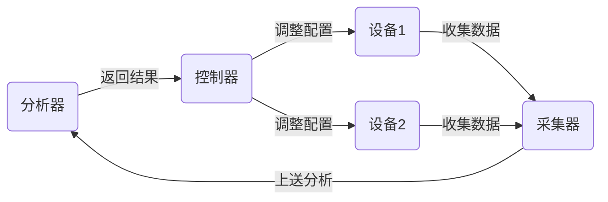

### Telemetry模型
**Telemetry**是一项远程的从物理设备或虚拟设备上高速采集数据的技术。设备通过**推模式**(Push Mode)周期性主动向采集器上送设备的接口流量统计、CPU或内存数据等信息，相对传统**拉模式**(Pull Mode)的一问一答式交互，提供了更实时更高速的数据采集功能。

相较于传统的网管系统，Telemetry拥有如下优点：
1. 精细监控：提升设备的采集能力，支持订阅上报机制，构建标准数据模型（YANG）。
2. 快速定位：在复杂的网络中能够快速定位故障，达到秒级甚至亚秒级。
3. 主动上报：采用一次订阅持续上报的方式，减轻了设备处理查询请求的压力。



Telemetry网络模型分广义和狭义两种:
- **广义Telemetry**：包括采集器、分析器、控制器和设备共同构成的一个自闭环系统。
- **狭义Telemetry**：指设备采样数据上送给采集器的功能。

在Telemetry模型中，采集器可以收集到大量的设备数据，然后将数据交给分析器进行综合分析，分析器将决策结果发送给控制器，由控制器调整设备的配置，便可以几乎实时地反馈调整后的设备状态是否符合预期。

### Telemetry框架
狭义的Telemetry框架可以分为四个模块：数据源、数据生成、数据订阅、数据推送。
```
    ┌───────────┐
    |  数据分析  |
    └─────┬─────┘
  ┌───────┴────────┐
  |  数据收集 gRPC  |
  └─┬──────────────┘
    ↓           ↑
┌───────┐  ┌────┴─────┐
| gRPC  |  | gRPC、UDP|
|数据订阅|  | 数据推送 |
└───┬───┘  └────┬─────┘
┌───┴───────────┴───┐
| 数据生成 protobuf  |
└─────────┬─────────┘
  ┌───────┴────────┐
  |   数据源 YANG   |
  └────────────────┘
```
> gNMI（gRPC Network Management Interface，gRPC网络管理接口）是基于gRPC框架开发的一种操作协议，定义了一系列用于设备状态获取和配置操作的RPC方法。gNMI支持通用数据模型，不需要为内容层额外提供业务模块.proto文件。

横向对比当前的四种常见的网络管理协议如下：
| 层级     | SNMP | NETCONF | RESTCONF | gRPC |
| -------- | ---- | ------- | -------- | ---- |
| 数据模型 | MIB  | YANG    | YANG     | YANG |
| 数据编码 | BER  | XML     | JSON     | GPB  |
| 通信层   | SNMP | NETCONF | RESTCONF | gRPC |
| 传输层   | UDP  | SSH     | HTTP     | HTTP2 |

### 订阅方式
Telemetry技术定义了两种订阅方式，分别为**静态订阅**（Dial Out）和**动态订阅**（Dial In）两种。
#### 静态订阅
设备作为客户端，采集器作为服务器。设备主动和采集器建立连接，将设备上配置的订阅数据推送给采集器。

1. 网管对设备下发静态配置，包括采样路径，采样周期，上送目标、编码等信息。
    - 支持CLI下发
    - 支持Netconf下发，Netconf使用的模型是`openconfig-telemetry.yang`
2. 设备启动数据采集任务，主动向采集器发起连接并推送数据。
    - 支持gRPC上送，RPC方法为`dataPublish`
    - 支持UDP上送

配置过程（以华为设备为例）：
```bash
# 配置采集器
system-view
  telemetry
    destination-group
      ipv4-address # 采集器 IP地址 端口号 上送目标采集器的协议和加密方式

# 配置传感器
system-view
  telemetry
    sensor-group
      sensor-path # 传感器采样路径
      # 或者自定义事件，例如：
      # sensor-path huawei-devm:devm/cpuinfos/cpuinfo condition express op-field systemCpuUsage op-type gt op-value 40

# 配置订阅
system-view
  telemetry
    subscription
      sensor-group # 关联采样传感器组 配置采样周期 冗余抑制和心跳间隔
```

#### 动态订阅
设备作为服务器，采集器作为客户端。由采集器主动向设备发起连接并订阅需要采集的数据信息。

1. 采集器向设备发起gRPC连接。
2. 采集器向设备发起动态订阅。
   - RPC方法：`Subscribe`
   - 指定采样路径、采样周期等信息
3. 设备启动采样任务，将采样数据作为RPC方法的应答，源源不断的返回给采集器。

配置过程（以华为设备为例）：
```bash
# 配置采集器
system-view
  grpc
    grpc server # GRPC服务器视图
      source-ip # 监听的源IP
      server-port # 监听的端口
      service enable # 使能GRPC服务
      # 可选：acl idle-timeout ssl-policy ssl-vertify peer
```
之后设备处于可被订阅的状态，采集器可以临时订阅某个设备参数。

### 数据生成
Telemetry数据生成采用GPB(Google Protocol Buffers)编码。GPB编码提供了一种灵活、高效、自动序列化结构数据的机制。GPB与XML、JSON编码类似，不同之处在于GPB是一种**二进制编码**，性能更好。

其编码过程示例如下：
- proto文件：
```protobuf
syntax = "proto3";

package telemetry;

message InterfaceStats {
  string name = 1;
  uint64 timestamp = 2;
  uint64 in_bytes = 3;
  uint64 out_bytes = 4;
  uint32 status = 5;  // 1=up, 2=down
}
```
- 解析前GPB，实际上是二进制数据：
```
字段1（字符串）: "GigabitEthernet0/1"
字段2（varint）: 1713506400 (timestamp)
字段3（varint）: 1000000 (in_bytes)
字段4（varint）: 2000000 (out_bytes)
字段5（varint）: 1 (status=up)
```
- 解析后GPB：
```json
{
  "name": "GigabitEthernet0/1",
  "timestamp": 1713506400,
  "in_bytes": 1000000,
  "out_bytes": 2000000,
  "status": 1
}
```
因为Protocol Buffers是以二进制的形式进行传输的，字节数较少，传输效率相比XML、JSON有天然的优势，而数据采集效率正是Telemetry考虑的重点之一。

### 数据推送
Telemetry的数据推送方式也存在两种，分别是基于gRPC和基于UDP。

**基于gRPC**
由于gRPC采用**面向连接**方式，因此由采集器与设备主控板CPU之间直接建立连接，具体流程如下：
1. 采集器充当gRPC客户端的角色，设备充当gRPC服务器角色
2. 采集器根据订阅的事件构建对应数据的格式(GPB/JSON)，通过ProtocolBuffers**编写**proto文件，采集器与设备建立gRPC通道，通过gRPC协议向设备**发送请求**消息。
3. 设备**收到请求**消息后，通过ProtocolBuffers**解析**proto文件，还原出最先定义好格式的数据结构，进行业务处理。
4. 数据处理完后，设备需要使用ProtocolBuffers**重编译应答数据**，通过gRPC协议向采集器应答消息。
5. 采集器收到应答消息后，结束本次的gRPC交互。

**基于UDP**
采集器也可以和线路卡CPU之间建立**UDP隧道**，由一对一变为**多对一**建立隧道，缓解了主控板CPU的压力同时也提升了效率。

**两种推送方式的对比**
核心架构与协议栈对比：
| 特性维度 | **gRPC Telemetry** | **UDP-based Telemetry** |
| :--- | :--- | :--- |
| **传输层协议** | **TCP** | **UDP** |
| **应用层协议** | **HTTP/2** + **Protocol Buffers** | 通常是**自定义二进制协议** 或 **gRPC over QUIC** |
| **数据格式** | **Protobuf** | Protobuf、JSON、XML、自定义二进制等 |
| **连接模型** | **面向连接**（长连接，双向流） | **无连接**（单向数据报） |
| **可靠性** | **高**（TCP保证：有序、不丢、不重） | **低**（依赖应用层或直接丢弃） |
| **时延** | 相对较高（有拥塞控制、队头阻塞） | **极低**（无连接建立、无重传） |
| **拥塞控制** | **有**（TCP Cubic/BBR等） | **通常无**（可能造成网络冲击） |
| **流控制** | **有**（HTTP/2流控制） | **无** |
| **部署复杂度** | 较高（需实现gRPC框架） | 较低（socket编程即可） |
| **典型场景** | 配置、状态、需要可靠性的数据 | 实时遥测、传感器数据、音视频流 |

应用场景对比：
| 选择 gRPC Telemetry | 选择 UDP-based Telemetry |
| :--- | :--- |
| 数据**必须可靠**传输 | 可以容忍**一定数据丢失** |
| 需要**双向交互** | 数据流主要是**单向的** |
| 网络环境**可控或质量好** | 追求**极致的端到端延迟** |
| 希望利用**现成框架和生态** | 需要**最大化吞吐量**，且硬件资源有限 |
| 传输**非实时性**的关键状态 | 传输**高频、海量、实时**的采样数据 |